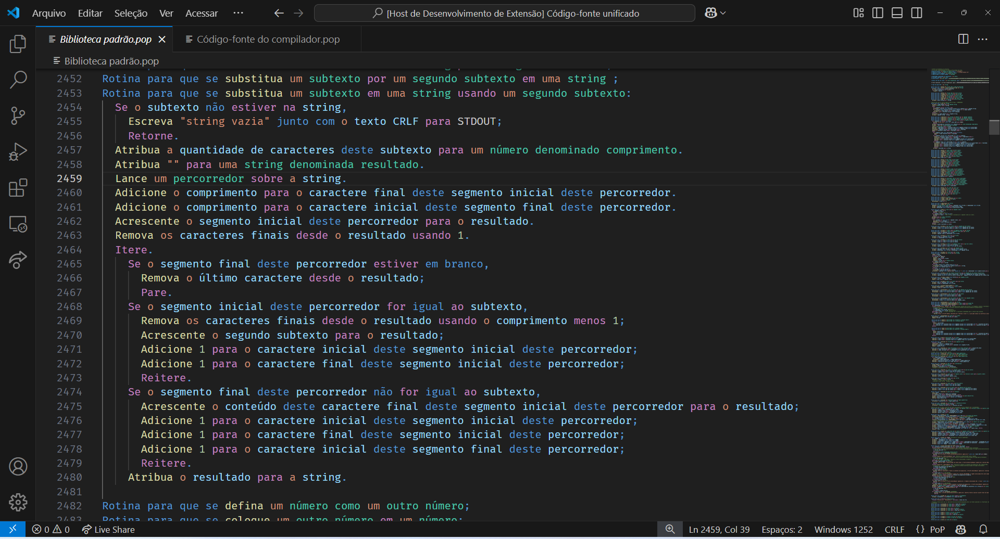
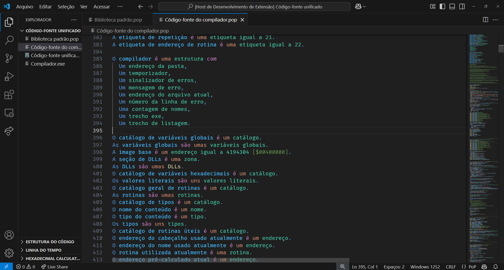

# Realçador de sintaxe para a Linguagem de programação "Português Puro" para o Visual Studio Code

[Logotipo](logo.jpeg)

## Descrição

Esta extensão do Visual Studio Code fornece destaque de sintaxe para a linguagem de programação "Português Puro", permitindo que os usuários escrevam e editem código em Português Puro com facilidade diretamente no editor.

O Português Puro é uma linguagem específica de domínio projetada para facilitar a compreensão e a legibilidade, criada por [Elender Gallas](https://www.linkedin.com/in/elender/) e [Élisson Gallas](https://www.linkedin.com/in/elissongois/). Para obter mais informações sobre o Português Puro, visite o [site oficial do projeto](https://portugues-puro.gitbook.io/documentacao).

## Recursos

- Destaque de sintaxe para arquivos de idioma Português Puro *(.pop)*
- Melhor legibilidade e clareza para código Português Puro no Visual Studio Code
- Integração perfeita com outros recursos e extensões do VS Code

## Instalação

Você pode instalar o Realçador de Sintaxe para Português Puro diretamente do Visual Studio Code Marketplace ou pesquisando por "Português Puro" na seção "Extensões" (Ctrl+Shift+X).

## Uso

Depois de instalada, a extensão aplica automaticamente o destaque de sintaxe a todos os arquivos com as extensões listadas acima. Basta abrir um arquivo Português Puro no Visual Studio Code para ver o destaque de sintaxe em ação.

## Suporte e feedback

Para suporte ou feedback sobre esta extensão, entre em contato conosco [aqui](https://github.com/elenderg/Portugues-Puro/issues). Agradecemos sugestões, relatórios de bugs ou solicitações de recursos.

---